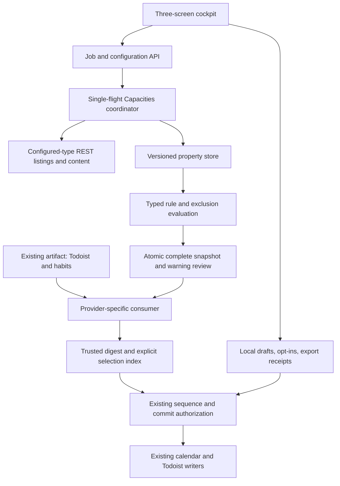
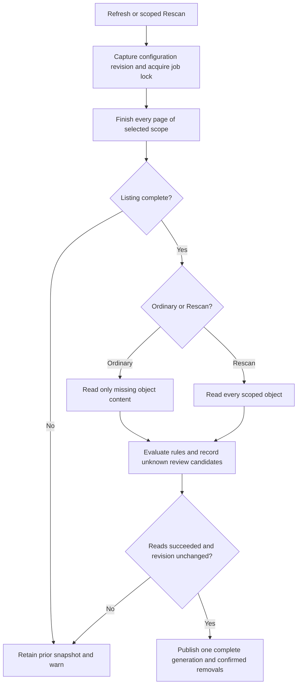
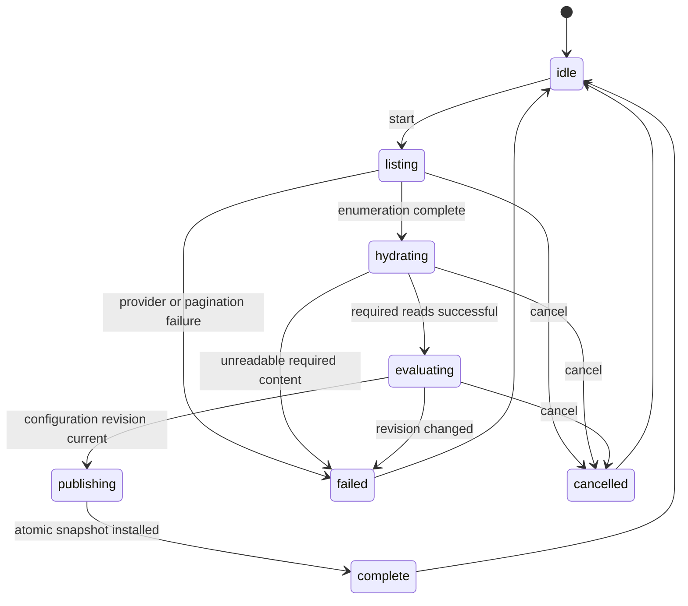
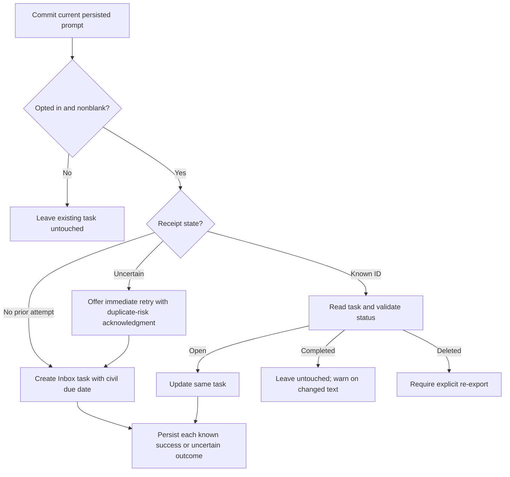

# TDTB Cached Refresh and Planning Flow - Plan

## Goal Capsule

**Objective.** The operator can refresh Capacities, review the day's commitments and candidates, and commit a time-blocked day from the existing TDTB cockpit without a separate Capacities ingestion skill.

**Means.** Direct REST acquisition with persistent properties and complete-result publication, integrated into the existing planning surfaces (KTD1–KTD4).

**Target repo:** TDTB.
**Authority.** This is a CE technical proposal, not approved execution state. The unchanged Product Contract at `docs/plan/2026-10-09-1345-feat-tdtb-capacities-cached-refresh-plan.md` owns R1–R39, KD1–KD12, and AE1–AE28. PIOS owns orchestration, approval, execution containment, review, and integration. TDTB owns domain behavior, TDD, and live-source safety. Root translates the accepted proposal into PIOS execution state; TDTB's approved plan evidence remains under `docs/plan/`. No downstream CE execution or review skill is automatically invoked.

**Execution profile.** Implement in an authorized linked worktree on a non-protected branch. Every behavior change is test-first. Children receive bounded units and do not recursively delegate. Root owns review and landing. Preserve unrelated work, the vault-off configuration, existing calendar routing, and non-Capacities ingestion.

**Stop conditions.** Stop on a failed execution-context guard, changed baseline or foreign ownership, invalidating Product Contract evidence, credential access, or an action requiring live-write/deployment approval. No unattended real-source writes, billed planning calls, or live restart.

---

## Product Contract

### Summary

Cover the full approved cached-refresh and three-screen planning flow by extending existing readers, rule evaluation, state stores, and UI components. Add test coverage for complete publication, cancellation, preserved selections, and prompt-export retry safety. Unrelated cleanup and ingestion changes remain outside this proposal.

### Problem Frame

The current artifact path requires separate Capacities ingestion, while the old live reader can defer content under a request budget. Neither provides the approved persistent complete-result contract or per-type editable rule builder. Existing prompt captures also lack the new opt-in and export lifecycle.

### Requirements

Adopt the source Product Contract's `### Requirements` in full: R1–R18 acquisition/cache, R19/R21 preservation, R20a–c UI, R22/R23/R36–R39 prompts, R24/R25 bounded gating, and R26–R35 eligibility and unknown review. Preserve its acceptance examples and scoped exclusions; the units below trace implementation to those stable IDs rather than restating their behavior.

**Confirmed clarification of R22.** Prompt due dates use the operator's local civil calendar date at Commit, even before the 02:00 TDTB planning-day rollover. Prompt draft and task identity remain keyed to the logical planning day. (session-settled: user-approved — chosen over logical-day due dates: exports are due on the current calendar date.) This clarification should be carried into the approved TDTB plan evidence during root materialization.

**Preservation interpretation.** R22 explicitly replaces only prompt-bearing daily-note/vault writes; R19 preserves other existing write paths. R27's unmapped Completion means unavailable, not an inferred unknown state. R29's mapped but undetermined completion is unknown. R31/R32 allow explicit warning-candidate selection, not automatic eligibility, and never bypass a known hard exclusion.

### Scope Boundaries

The source Product Contract's boundaries remain in force. Todoist rows and habit calculations retain their existing artifact intake. No new Capacities writes, autonomous schedule, TickTick integration, complete vault-reader deletion, calendar-class redesign, or general UI redesign is included.

#### Deferred to Follow-Up Work

Recurring provider/resumption failures and harness tuning remain separate investigations. Host documentation reconciliations that require deprecated repository access are not silently run from this session. If launch readiness requires a specifically named external instruction or check, root resolves that boundary before execution.

---

## Planning Contract

### Key Technical Decisions

- KTD1. **A dedicated persisted refresh coordinator owns acquisition and publication.** Extend transport/projection seams rather than executing long reads inside `/plan-inputs`. Maintain a server-owned job identifier, generation, scope, progress, and last complete snapshot. Serialize Capacities jobs across Refresh and Rescan with a machine-local lock; status reads do not make provider calls. Applies R1–R7/R10–R18/R34 (instantiates KD1/KD2/KD3; session-settled: user-approved — chosen over bridges and progressive publication: standalone refresh must publish a trustworthy complete result).
- KTD2. **Versioned content storage does not expire valid properties during ordinary Refresh.** Adapt `_ContentCache` behind the coordinator while leaving its legacy live-reader contract intact. Key by provider origin, space, type, and object; store content-read time separately from listing-check time. Import only compatible legacy entries without modifying their source. Use atomic per-object persistence and a separate atomic complete-generation pointer. Unlike the current 4096-entry/16-MB LRU, the new store may not silently evict members of a published scope: reaching a storage bound stops with a warning and preserves the last result. Applies R2/R5/R12/R15/R16/R21 (session-settled: user-approved — chosen over TTL-driven rereads: existing property changes require explicit Rescan).
- KTD3. **Completion evidence is scoped and generation-bound.** A successful ordinary Refresh completes all configured types before one generation is published. A type Rescan updates its type only after all pages and required reads succeed; combine it with unchanged, visibly dated prior type snapshots rather than claiming other types were rescanned. Any all-types failure prevents combined publication. Complete listing absence is the sole removal evidence. Failed/cancelled runs retain successful content reads but not candidate removals or partial result pointers. A configuration revision change invalidates stale job publication. Applies R4/R6/R10/R13–R16/R30/R34/R35.
- KTD4. **One source per provider at the consumer seam.** In the new Capacities mode, take Todoist rows and habits from the existing artifact, discard artifact Capacities rows, and merge coordinator rows once. Do not switch globally to live mode or alter artifact files to achieve this. Preserve the existing Capacities identity and URI path, duration-memory overlay ownership, name disambiguation, and digest indexing. Add provider-specific intake configuration with an explicit legacy rollback choice; a missing direct snapshot warns and yields no-Capacities, never silent artifact/live fallback. Applies R1/R21/R24b/R28.
- KTD5. **A typed per-type rule revision replaces hidden eligibility switches.** Reuse the safe recursive predicate machinery in `producer_rules.py` through a Capacities-specific normalized record interface. Persist active and draft revisions plus mappings and fallback duration through `SourceRecord`-style optimistic revision and atomic save. Validate properties and operators against discovered type shape; distinguish absent cached values from false predicate results. Compatible native/active/assigned controls edit visible rules rather than running extra hidden admission logic. No arbitrary code or user regex execution is added. Applies R8/R9/R20c/R26/R27/R31/R33.
- KTD6. **Published membership, evaluation, and selection are separate states.** Keep evaluated admitted rows distinct from supplementary warning candidates. Resolve hard exclusions before selection retention. Store explicit selections server-side by stable identity and revision, including acknowledged warning candidates and retained disabled-type rows. Feed selected trusted rows into the existing assigned digest index and commit eligibility boundary; never accept browser-supplied identity/routing as authorization. Treat uncertain tag evidence conservatively and keep the existing exclusion safety behavior. Applies R25/R27–R35.
- KTD7. **Capacity/source warnings do not become write authorization.** Audit frontend and server gates individually. Apply R24's fallback specifically to Capacities availability and overcapacity; do not waive calendar timing integrity, day-setup confirmation, native pins, overlap grants, snapshot checks, single-flight locking, or source identity validation. Unknown capacity/absent reliable calendar data is not the same as a measured overcapacity day. Applies R24/R25.
- KTD8. **Prompt draft, preferences, and export receipts have separate machine-local lifecycles.** Add versioned atomic stores under the existing state-directory abstraction. Drafts and receipts use logical day plus prompt key; opt-ins are undated. Use the server's persisted draft and choice at the manifest boundary, not unchecked request text. Remove B6 prompt-frontmatter output without retiring unrelated vault operations. Task creation remains Commit-only and excluded from calendar routing/duration. Applies R22/R23/R36–R39 (instantiates KD6/KD8).
- KTD9. **Prompt exports have explicit per-action receipts.** A known task ID drives updates, completed/deleted checks, and explicit re-export. Persist success immediately after each confirmed action so retry skips it. An ambiguous create is recorded as uncertain, not successful or deduplicated by content. Offer the operator's immediate retry with duplicate-risk acknowledgment under R39. Store the original civil due date with a confirmed export; a repeat logical-day Commit updates that same task using the current civil due date when permitted. Prompt tasks route to Inbox; apply PHEP to other Todoist export creation without moving existing upstream tasks between projects. Applies R22/R36–R39.
- KTD10. **UI integration preserves the existing engine.** Build Set up day, Plan tasks, and Connections around current components/controller, with mockups as layout/behavior reference. Retain copy-prompt, drag/accessibility interactions, duration overrides, native fixed timing, completion and undo behavior. Replace warning-text parsing with structured Capacities job/coverage fields in the API adapter. Applies R7/R16/R20/R24/R25.

### High-Level Technical Design

**Component and data-flow topology**

**Refresh protocol, mode, and publication decisions**

**Acquisition state machine and interruption lifecycle**

A process restart leaves the published snapshot usable and reports an interrupted job instead of resuming stale publication. Successful object writes remain available for the next run. Publication is a small protected atomic step; cancel after publication does not undo a completed generation.

**Rule grammar and evaluation decision shape**

Directional grammar: a rule is an AND group, OR group, NOT child, or typed property comparison. Property operands reference discovered stable keys; comparisons are restricted to compatible equality, membership, existence, ordering, and date operations already supported by the reusable evaluator. Three-valued evaluation propagates unknown rather than treating a missing value as false. Known hard exclusions take precedence over inclusion and explicit selection; unmapped Completion is unavailable rather than unknown (R27/R29).

**Prompt export lifecycle**

### Implementation Constraints and Risks

The API's content-read limit is 30 requests/60 seconds; listings have separate provider limits and page cost. Use one shared endpoint-aware pacer, honor reset/retry headers and 429 responses, and test with a fake clock. Static per-refresh budgets and producer coverage cursors are not complete-result pacing. Bound retries and surface terminal errors rather than waiting indefinitely. Cache failure must never be represented as a freshly read value.

The existing server commit path validates source identity from a dated digest index and protects native timing. The candidate-selection change must extend that authority, not bypass it. The frontend already retains a last view on failure, but that is not a durable server snapshot. Prompt content is local personal state: never include it or credentials in diagnostic logs, generated fixtures, or repository evidence.

### Deferred Implementation Details

Exact route/helper names, safe storage capacity thresholds, retry-count tuning, and detailed visual spacing are determined within units. Measure warm refresh latency rather than claiming the approximate target from mocks. No launch-blocking product question remains; credential provisioning, approved baseline/worktree, and required policy checks must be resolved before implementation begins.

---

## Implementation Units

### U1. Durable cache and complete snapshot foundation

**Goal:** Persist restart-safe content and complete generations without TTL-driven rereads or silent eviction.
**Requirements:** R2/R5/R6/R13/R15/R16/R21/R34; KTD2/KTD3; AE1/AE6/AE22.
**Dependencies:** None.
**Files:** `app/capacities_builder.py`, new `app/capacities_refresh_state.py`, new `app/tests/test_capacities_refresh_state.py`, `app/tests/test_capacities_builder.py`.
**Approach:**
1. Add versioned per-object persistence and a namespace-isolated complete snapshot store using existing atomic state-store patterns.
2. Import compatible legacy cache content read-only, recording original freshness rather than fabricating current read times.
3. Protect generation installation and reconcile interrupted job metadata on restart.
**Execution note:** Demonstrate failing durability/publication tests before behavior changes.
**Test scenarios:**
- Covers AE1. A valid entry older than the old TTL remains available with its original content-read time.
- Covers AE6. Absence in an incomplete listing does not evict a published member; complete confirmed absence does.
- Corrupt schema, namespace mismatch, or exhausted storage prevents installation and preserves the prior generation.
- Covers AE22. Interrupt a run after successful content writes; restarting preserves those reads and the old snapshot.
- Concurrent writers cannot replace a newer revision or leave a torn generation pointer.
**Verification:** Durable state round-trips and failure recovery pass; legacy cache tests remain unchanged in meaning.

### U2. Paced Refresh and scoped Rescan jobs

**Goal:** Complete configured scope with truthful progress and cancellation.
**Requirements:** R1/R3–R7/R10–R18/R19/R34/R35; KTD1–KTD3; AE1/AE2/AE4–AE7/AE22/AE23.
**Dependencies:** U1.
**Files:** `app/capacities_adapter.py`, `app/capacities_builder.py`, new `app/capacities_refresh.py`, `app/main.py`, new `app/tests/test_capacities_refresh.py`, new `app/tests/test_capacities_refresh_route.py`.
**Approach:**
1. Extract reusable listing/content access from legacy budget behavior without rewriting the legacy reader.
2. Add coordinator start/status/cancel seams, shared pacing, revision checks, and complete-scope projection.
3. Replace the max-pages success possibility with an explicit incomplete outcome; retain repeated-cursor protection.
**Test scenarios:**
- Covers AE1/AE2. Warm listing reads no content; one new object costs one successful content read.
- Covers AE4. Single-type Rescan rereads that type only; all-types Rescan rereads all configured types.
- Covers AE5. Failure on page two, repeated cursor, or defensive page bound never publishes truncated membership.
- Covers AE7. Cold import spans multiple paced windows and remains responsive to status/cancel.
- Rate reset and 429 backoff are honored with a fake clock; terminal authentication/transport failure warns without exposing secrets.
- Covers AE22. Cancel during hydration retains successful content writes but installs no new generation.
- Two racing jobs, config save during evaluation, and process interruption cannot publish stale scope.
**Verification:** Fake-provider integration proves request pacing, complete pagination, single-flight behavior, and atomic results without real API calls.

### U3. Typed per-type rules, mappings, and selection authority

**Goal:** Make saved rules authoritative while keeping unknown review and explicit selections safe.
**Requirements:** R8/R9/R20c/R26–R33/R35; KTD5/KTD6; AE3/AE13–AE21/AE23.
**Dependencies:** U1; U2 for job integration.
**Files:** `app/producer_rules.py`, `app/capacities_settings.py`, `app/capacities_builder.py`, `app/tag_exclusions.py`, `app/runstate.py`, new `app/capacities_rules.py`, new `app/tests/test_capacities_rules.py`, new `app/tests/test_capacities_selections.py`, `app/tests/test_capacities_source_route.py`.
**Approach:**
1. Adapt recursive predicates to discovered per-type property schemas and separate active/draft revisions.
2. Normalize admission, completion availability, hard exclusions, and warning candidates without guessed mappings.
3. Persist explicit selections and retained disabled-type rows by identity; supply trusted selected rows to digest indexing.
**Test scenarios:**
- Covers AE3/AE14. Nested AND/OR/NOT changes evaluate cached content without reads or a hidden active toggle.
- Covers AE15. Missing Duration/Assignment/Completion mappings use explicit fallbacks and unavailable completion.
- Covers AE17. Excluded tags or known completed/dropped states remove schedulable selections with notices.
- Covers AE18. Rule change/type removal retains prior selection with warning, except hard exclusions.
- Covers AE19/AE20. Missing cached property creates a supplementary warning candidate; explicit selection succeeds with safe values and no false evaluation claim.
- Covers AE21. Removed schema property or incompatible comparison cannot activate; optimistic save conflict preserves active rules.
- Malicious property paths/unsupported operators and browser-forged identities cannot become trusted selections.
**Verification:** Rule truth tables, settings revision tests, and server-index selection integration pass while producer regressions remain intact.

### U4. Provider-specific intake and bounded Commit gating

**Goal:** Consume direct Capacities once and permit approved warning-only paths without weakening write safety.
**Requirements:** R21/R24/R25/R28/R30/R32/R35; KTD4/KTD6/KTD7; AE10–AE12/AE16/AE18/AE20/AE23.
**Dependencies:** U2/U3.
**Files:** `app/app_config.py`, `app/artifact_source.py`, `app/external_sources.py`, `app/main.py`, `app/runstate.py`, `app/tests/test_main_api.py`, new `app/tests/test_capacities_intake.py`, frontend `src/adapters/api.ts`, `src/adapters/wire.ts`, `src/store/store.ts`, corresponding existing adapter/store tests.
**Approach:**
1. Add provider-specific selection and structured job/coverage metadata while preserving Todoist/habit artifact parsing.
2. Reconcile selected Capacities rows into trusted server indexes and enforce their identity at shadow/live boundaries.
3. Change only applicable warning gates and retain independent safety failures.
**Test scenarios:**
- Old artifact Capacities rows and new direct rows with the same identity yield exactly one direct row.
- Calendar and habits still contribute when live Todoist constructors are stubbed to raise.
- Covers AE10/AE11. Failed direct refresh uses last complete snapshot or explicit no-Capacities, with correct warnings and allowed valid Commit.
- Covers AE12. Measured overcapacity warns; native pin changes, unauthorized identities, malformed input, stale planning snapshot, missing day setup, and concurrent Commit still fail before writes.
- Covers AE16/AE20. Unselected candidates never consume capacity or enter the manifest; acknowledged warning candidates use server-authorized fields.
- Calendar degradation is not accidentally relaxed as Capacities failure.
**Verification:** Fake-writer shadow/live route tests prove both bounded relaxation and preserved denial paths.

### U5. Local prompt drafts and persistent opt-ins

**Goal:** Preserve same-day drafts and choices without prompt vault writes.
**Requirements:** R22/R23/R37/R38; KTD8; AE8/AE9/AE26/AE27.
**Dependencies:** None; integrates before U6.
**Files:** `app/runstate.py`, new `app/prompt_state.py`, `app/main.py`, `app/shadow.py`, new `app/tests/test_prompt_state.py`, `app/tests/test_shadow.py`, `app/tests/test_main_api.py`.
**Approach:**
1. Add atomic logical-day draft and undated preference stores using the state-directory seam.
2. Wire day-setup reading/writing to the new prompt surfaces without changing other runstate fields.
3. Remove prompt frontmatter manifest generation and characterize preservation of unrelated output.
**Test scenarios:**
- Covers AE27. Restart preserves same-day text; logical rollover clears text and preserves each opt-in.
- At 00:30 the prior logical-day draft remains available; civil-date export behavior belongs to U6.
- Covers AE8. Saving drafts/preferences performs no Todoist, calendar, or vault prompt write.
- Corrupt draft/preference input warns safely and does not copy another day's text.
- Non-prompt vault output, day-setup confirmation, and micro-adventure behavior remain unchanged.
**Verification:** Fixture-only state and manifest tests prove the lifecycle and no prompt-vault output.

### U6. Commit-only prompt exports and per-action recovery

**Goal:** Export the three optional prompts with durable task identity and honest retry behavior.
**Requirements:** R22/R36–R39; KTD8/KTD9; AE8/AE24–AE28.
**Dependencies:** U5; U4 for integrated commit authorization.
**Files:** `app/shadow.py`, `app/commit.py`, `app/commit_run.py`, `app/todoist_client.py`, `app/prompt_state.py`, `app/main.py`, new `app/tests/test_prompt_export.py`, `app/tests/test_commit.py`, `app/tests/test_shadow.py`.
**Approach:**
1. Extend manifest construction with independent prompt task actions from persisted server state.
2. Resolve Inbox/PHEP through existing project seams and persist per-action export receipts.
3. Integrate completed/deleted/uncertain results with existing partial-success orchestration and explicit re-export.
**Test scenarios:**
- Covers AE8. One opted-in prompt creates exactly one Inbox task at Commit, with no duration/calendar action; other export creation targets PHEP.
- At 00:30 Commit the task is due on the civil date while receipt identity remains the logical planning day.
- Covers AE24/AE25. Repeat Commit updates known ID; completed task stays complete; deleted task requires explicit re-export.
- Covers AE26. Opt-out and blank text leave existing tasks untouched.
- Covers AE28. Timeout after possible create records uncertainty, offers acknowledged immediate retry, and never claims guaranteed idempotency.
- Three exports with one failure persist two successes; resume retries only the failed action, including after restart.
- Forged draft/task ID or malformed receipt fails safely; unrelated existing Todoist tasks are not moved between projects.
**Verification:** Fake-provider integration demonstrates per-action receipts and zero unintended writer actions.

### U7. Integrate the approved three-screen flow

**Goal:** Present the new behavior through Set up day, Plan tasks, and Connections without replacing planning engines.
**Requirements:** R7/R16/R20/R22/R23/R24/R26–R39; KTD10; UI-bearing AE8–AE28.
**Dependencies:** U2–U6 API contracts.
**Files:** `frontend/src/ui/DaySetupPanel.tsx`, `SetupDrawer.tsx`, `AnchoredEditor.tsx`, `ExecutionView.tsx`, `Queue.tsx`, `ActionDock.tsx`, `ApprovalDrawer.tsx`, `CapacitiesSourceEditor.tsx`, `CapacitiesSettingsPanel.tsx`, `TagExclusionSettingsPanel.tsx`, `ReadinessStrip.tsx`, `frontend/src/store/controller.ts`, `refreshLifecycle.ts`, UI stylesheet/owning app navigation, matching existing UI/store tests plus new rule-builder/prompt-export tests; approved mockup copies under `docs/plan/2026-10-09-capacities-refresh-ui/` if needed for portable evidence.
**Approach:**
1. Consolidate navigation and reuse day-frame/Mint/anchor/allocation components against the supplied mockup baseline.
2. Add typed nested rule editing, mappings/discovery, draft save/discard, admission preview, warning review, and one/all Rescan controls.
3. Add job progress/cancel, distinct cached freshness, prompts/opt-ins/re-export, and bounded warning-only approval displays.
**Test scenarios:**
- Set up day honors preset/frame/buffer, drag and keyboard equivalents, outside-frame/skipped anchors, prompts, and micro-adventure.
- Plan tasks preserves Critical/When there's room/Fixed/Out today, assignment, duration, exclusion/undo, completion/reorder, sequence/commit, and copy-prompt.
- Connections edits nested predicates, discovers/maps properties, shows stale tags/admission reasons, and saves/discards without hidden eligibility.
- Cancel, Rescan one/all, no-result/fallback, unknown review, type removal, and partial prompt failure remain actionable and truthful.
- Responsive narrow layout and keyboard focus retain controls; illustrative mock numbers/counters are not hard-coded.
**Verification:** UI/controller tests, typecheck, both builds, and mocked browser walkthrough support the approved layout and behavior without billed calls or real writes.

### U8. Integrated evidence, rollout, and restartable landing

**Goal:** Prove the full outcome and prepare a reversible, attended cutover.
**Requirements:** R1–R39 and AE1–AE28; all KTDs.
**Dependencies:** U1–U7.
**Files:** Existing integration tests, new `app/tests/test_capacities_refresh_end_to_end.py`, frontend fixture walkthrough coverage, scoped acceptance evidence under `docs/plan/2026-10-09-capacities-refresh-ui/`, affected current operator docs.
**Approach:**
1. Run an end-to-end fake-provider walkthrough through restart, rule save, Refresh/Rescan, selection, sequence, shadow, and partial export recovery.
2. Record measured warm-refresh behavior, baseline failures, built-bundle read-back, and independent implementation review.
3. Prepare provider-specific rollback without touching the existing artifact producer; root handles path-scoped landing and separately approved deployment.
**Test scenarios:**
- A mixed-provider planning day survives refresh cancellation/restart and Commit recovery with stable identities.
- Rollback uses the explicitly selected old provider intake and does not mix new/old Capacities rows.
- Large paginated cold scope, storage failure, and missing credentials never produce a truncated success.
- Trace each source acceptance example to obtained deterministic evidence; no source writes or billed calls occur in scratch verification.
**Verification:** The Verification Contract passes or names a blocking baseline issue; integration diff contains only intended work.

---

## Verification Contract

**Planning evidence:** current source inspection and the unchanged approved contract. No implementation tests, builds, service probes, or live source calls were run to generate this proposal.

**Implementation gates:**

| Gate | Applies | Evidence required |
| --- | --- | --- |
| Execution-context and ownership guard | Before each writable slice and review/landing | Correct linked worktree/branch/pinned HEAD and owned-path hashes; no foreign changes overwritten |
| TDD | U1–U7 behavior | Observed failing scenario before implementation, passing scenario after, focused regression evidence |
| Backend suite | All units | Repository Python environment runs backend pytest, including bootstrap runner tests |
| Frontend suite/typecheck | U4/U7/U8 | `npm test` and `npm run typecheck` from `frontend/` |
| Generated builds | U7/U8 | `npm run build:mockup` and `npm run build:prod`, followed by bundle-reference/content read-back |
| Scratch walkthrough | U8 | Fixture/mocked `:8790` walkthrough, zero billed calls, zero real-source writes |
| Independent review and diff | Before integration | Accepted review, owned-path `git diff --check`, intended diff and fresh Git/worktree evidence |

Use the repository's discovered Python runner for backend pytest rather than assuming the shell interpreter has dependencies. Resolve any externally hosted mandatory policy checks through an explicitly approved boundary before execution; never claim them run from local static evidence. Planning cannot establish runtime warm latency. After implementation, measure ordinary refresh with representative cached scope and report the approximately two-minute target honestly.

Live `:8746` is never a test fixture. No live `POST /commit`, `/sequence`, or `/adjust` is authorized by this plan. A service restart, machine-local intake/config cutover, credential access, or real-provider writes needs its own attended approval. `/version` reflects Git HEAD and cannot alone prove newly loaded backend code; approved deployment needs behavioral GET-only evidence.

---

## Definition of Done

Each unit has observed test-first evidence, passing focused scenarios, and independent acceptance before landing. The integrated cockpit delivers the source Product Contract, including explicit warning review rather than partial publication, per-type cache freshness, safe selection and commit authorization, and prompt recovery.

The required suites/builds and fixture walkthrough support the actual outcome. Generated artifacts are read back, no abandoned-attempt code remains, no unrelated work is altered, no secrets/personal drafts enter repository evidence, and all baseline failures or unrun gates are disclosed. Root-approved execution state and TDTB acceptance evidence link to the actual landed commits. Until separately approved deployment and cutover evidence exists, report implementation as locally delivered, not live.

---

## Appendix

**Research anchors:** `app/capacities_builder.py` (`_ContentCache`, `SourceRecord`); `app/capacities_adapter.py` (`_list_objects`, `_hydrate_object`, `_project_object`); `app/producer_rules.py` recursive predicates and coverage cursor; `app/artifact_source.py` never-silent-fallback consumption; `app/main.py` `post_commit` and `_validate_commit_eligibility`; `app/shadow.py` capture/B6 manifest; `app/commit.py` task/vault writers; frontend controller/wire/store/refresh lifecycle.

**Prior lessons:** `docs/plan/2026-10-08-capacities-first-migration/plan.md` provides logical-day, calendar-seam, candidate-routing, and request-budget failure evidence. `docs/plan/2026-10-07-tdtb-cockpit-ui-round2/plan.md` provides bundle provenance and prompt re-homing evidence. Neither historical plan overrides the approved Product Contract.

**External contract:** Capacities Developer API OpenAPI facts recorded in the Product Contract: paginated type summaries omit object properties; content reads cost provider requests. Verify current endpoint limits during implementation using public documentation without credentials before choosing exact pacing ceilings.

**Review routing:** Automatic `ce-doc-review` is suppressed by the PIOS adapter, not a passed review. Root review checks preservation, grounded seams, gate safety, and unit readiness; any unresolved material finding blocks launch. The approved mockup files remain external inputs until portable evidence is deliberately materialized without adding illustrative data as requirements.
